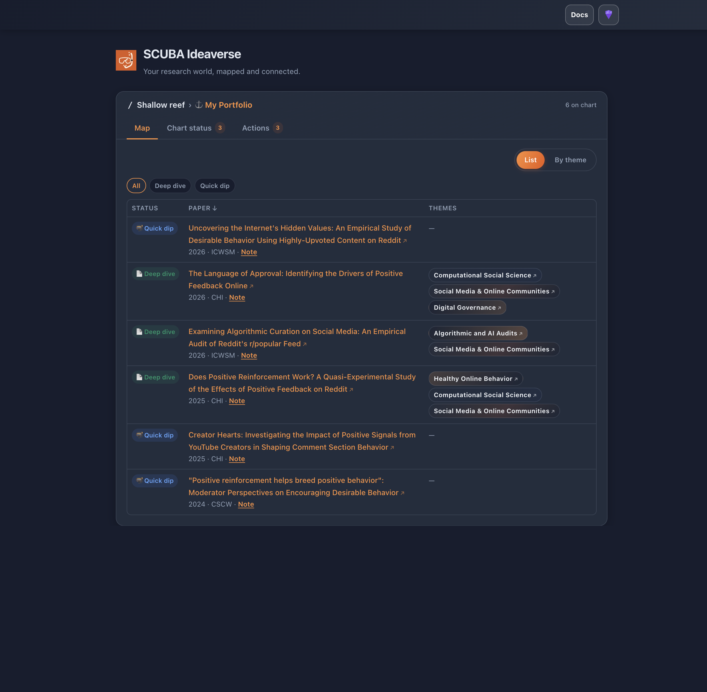

# Portolan

**Read what you dock. Chart the connections.**

Built for reading, in a world built for writing — Portolan keeps you oriented as the ocean of research keeps rising. The research assistant that actually reads your papers.

In a world that rewards writing and creating, almost nothing helps you read and connect. Portolan is a consumption tool. It reads what you dock and keeps you oriented in your field so you stop losing the thread.

Portolan is the layer between Zotero and Obsidian. Zotero stores, Obsidian links, neither reads your papers for you. The verb that is ours is **reads**. The asset is a compounding knowledge base: accumulation, not storage. Plain markdown you own and version with git. Works for one dissertation or a whole lab.

Built by the [SCUBA Lab](https://eshwarchandrasekharan.com/lab.html) at UIUC and shared openly under [MIT](LICENSE). Implements the [LLM Wiki pattern](https://gist.github.com/karpathy/442a6bf555914893e9891c11519de94f) by Andrej Karpathy. The system (**dock → chart → enrich → Obsidian**) is corpus-agnostic: point it at your own papers and notes.

<p align="center">
  
</p>
<p align="center"><em>Shallow reef · My Portfolio — Navigate filtered to Deep dive (3 charted papers).</em></p>

---

## The control panel

A web app for docking artifacts, **Quick Dip** (Tier 1 PDF facts on chart), **Deep Dive** enrichment, **Navigate** browsing, and **Status** tracking.

```bash
./manager/scripts/dev.sh    # → http://127.0.0.1:5173
```

| Step | Action |
|------|--------|
| 1 | Pick a **reef**, then a **dock** (hover pills for what each channel is) |
| 2 | Work in the **workspace** — `Reef › Dock` path, tabs for Navigate / Status / Actions |
| 3 | **Dock** files — click the dock name in the path, or **Upload PDFs** in Actions |
| 4 | Check **Status** — on chart, quick dip, enrich next |
| 5 | **Navigate** — List, By theme, or Graph; **Edit** → mark **−** → **Done** to remove from chart (PDFs stay in dock) |
| 6 | **Deep Dive** via **Get ingest prompt** or edit `builder/entries/` + `builder/deepdives/` |
| 7 | Open reef in Obsidian |

Full guide: **[docs/PORTOLAN.md](docs/PORTOLAN.md)** · Chart spec: **[docs/PAPER-CHART-SPEC.md](docs/PAPER-CHART-SPEC.md)**

---

## Three ways to use it

### 1. Portolan (UI) — *recommended for teams*

Dock → Quick Dip → Deep Dive → Obsidian. Uploads stay in `raw/`; Tier 1 chart entries land in `builder/entries/` from PDF facts only (no guessing). **Status** shows **Quick dip**, **Enrich next**, and **On chart** counts per dock.

### 2. LLM-driven ingest (agent workflow)

Drop documents into `raw/`, open the folder in Cursor or Claude Code, and say:

> *"Ingest the new papers in `raw/`."*

The assistant reads [`CLAUDE.md`](CLAUDE.md) and writes `wiki/sources/`, entities, concepts, syntheses. See [`CLAUDE.md`](CLAUDE.md) §6.

### 3. Deterministic builder (CLI / cron)

For a **paper portfolio mapped by research theme**, run `python3 builder/build.py`. Idempotent, scriptable. See [BUILD.md](BUILD.md).

You can combine all three: Portolan for docking and chart scaffolding, the agent for deep dives and ingest, the builder for reproducible rebuilds.

---

## Quickstart

```bash
git clone https://github.com/ceshwar/build-research-wiki.git
cd build-research-wiki

# Option A — try the UI + Shallow reef (demo)
./manager/scripts/dev.sh
# → http://127.0.0.1:5173 — pick **Shallow reef** in the header

# Option B — browse the demo reef in Obsidian
open examples/minimal-vault   # or: File → Open folder as vault in Obsidian

# Option C — start your own reef
python3 builder/new_vault.py ~/my-research-wiki "My Lab"
```

**New here?** → [Getting started](docs/GETTING-STARTED.md) · [Portolan guide](docs/PORTOLAN.md) · [Shallow reef (demo)](examples/minimal-vault/) · [Team collaboration](docs/TEAM-COLLABORATION.md)

---

## How it's organized

```
build-research-wiki/
├── manager/              # Portolan UI (FastAPI + React)
├── CLAUDE.md             # wiki schema — how the assistant operates
├── index.md, log.md      # catalog + chronological record
├── raw/                  # immutable uploads (dock here)
│   ├── papers/           #   portfolio PDFs
│   ├── literature/       #   lit review
│   ├── transcripts/      #   lab memory
│   └── notes/inbox/      #   ideas
├── builder/
│   ├── templates/        #   default entry templates per channel
│   ├── entries/          #   your chart notes (themes, abstract, one-liner)
│   ├── deepdives/        #   generative sections (RQ, method, findings, …)
│   ├── data.py           #   corpus (themes, papers, concepts, people)
│   └── build.py          #   chart generator
└── wiki/                 # generated chart (papers, themes, sources, …)
```

**Rule:** `raw/` is never modified by the chart build. Edit `builder/entries/` and `builder/deepdives/`, then re-run **Update chart** in the UI or `build.py`.

---

## Documentation

| Doc | What it covers |
|-----|----------------|
| [Portolan](docs/PORTOLAN.md) | UI workflow, channels, completion states, roadmap |
| [Roadmap](docs/ROADMAP.md) | Phased next steps + GitHub issue script |
| [Getting started](docs/GETTING-STARTED.md) | Onboarding paths + first-session checklist |
| [Team collaboration](docs/TEAM-COLLABORATION.md) | Shared repos, git norms, privacy |
| [Changelog](docs/CHANGELOG.md) | Release notes |

---

## Why not just ChatGPT or NotebookLM?

Sessions forget when you close the tab. Portolan keeps a persistent, inspectable chart in plain markdown under git. You see what was read, what links to what, and how the synthesis compounds over time.

---

## Credits

Built by the **[SCUBA Lab](https://eshwarchandrasekharan.com/lab.html)** (Social Computing, User Behavior, and AI) at UIUC. Implements the **[LLM Wiki](https://gist.github.com/karpathy/442a6bf555914893e9891c11519de94f)** pattern by Andrej Karpathy, adding research-specific formats, a portfolio chart builder, and team docs. Shared openly so other labs can run it on their own corpus.
